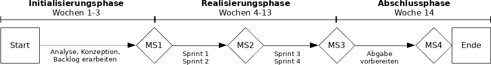

# Rahmenplan

| Wochen | Von (Datum) | Bis (Datum) | Phase                | Tätigkeiten                                   |
|-------:|------------:|------------:|----------------------|-----------------------------------------------|
|    1-3 |  16.09.2019 |  06.10.2019 | Initialisierunsphase | Initialisierung, Planung, Analyse, Konzeption |
|   4-13 |  07.10.2019 |  15.12.2019 | Umsetzungsphase      | iterative Implementierung (Sprints)           |
|     14 |  16.12.2019 |  21.12.2019 | Abschlussphase       | Schlussabgabe vorbereiten                     |

\

# Meilensteinplan

Die Projektziele _lauffähiger Prototyp_ und _Softwaredokumentation_ werden
iterativ in vier Sprints erarbeitet, d.h. nach jede Sprint gibt es einen
lauffähigen Prototyp (wenn auch mit beschränktem Funktionsumfang) und eine
aktuelle (wenn auch unvollständige) Softwaredokumentation. Die Projektziele
_Teststrategie_ und _Abschlussbericht_ werden nach dem ersten bzw. vierten
Meilenstein erreicht.

| Woche |      Datum | Nr | Meilenstein                             | Artefakte                                   |
|------:|-----------:|---:|-----------------------------------------|---------------------------------------------|
|     3 | 06.10.2019 |  1 | Backlog und Konzept bereit              | Analyse, Grobkonzept, Testkonzept, Backlog  |
|     9 | 10.11.2019 |  2 | Login- und Token-Handling funktionieren | Prototyp, Dokumentation, Meilensteinbericht |
|    12 | 01.12.2019 |  3 | Signifikante Abdeckung der API erreicht | Prototyp, Dokumentation, Meilensteinbericht |
|    14 | 21.12.2019 |  4 | Bericht abgabebereit                    | Abschlussbericht                            |

# Wochenplan

Der Wochenplan dient zur persönlichen Planung der Tätigkeiten und gibt einen
Überblick über die ungefähr zu leistenden Arbeitsstunden.

| Woche | Von (Datum) | Tätigkeit                                                         | Aufwand (h) |
|------:|------------:|-------------------------------------------------------------------|------------:|
|     1 |  16.09.2019 | Projektstart (Kick-Off-Meeting) und Projektplanung                |           4 |
|     2 |  23.09.2019 | Projekt- und Meilensteinplanung, Technologie-Evaluation, Analyse  |          12 |
|     3 |  30.09.2019 | Konzeption, Erarbeitung und Priorisierung Backlog, Sprint-Planung |          20 |
|     4 |  07.10.2019 | Sprint 1                                                          |          12 |
|     5 |  14.10.2019 | Sprint 1                                                          |          12 |
|     6 |  21.10.2019 | Dokumentation, Feedback einholen/verarbeiten, Sprint-Planung      |          12 |
|     7 |  28.10.2019 | Sprint 2                                                          |          12 |
|     8 |  04.11.2019 | Sprint 2                                                          |          12 |
|     9 |  11.11.2019 | Dokumentation, Feedback einholen/verarbeiten, Sprint-Planung      |          12 |
|    10 |  18.11.2019 | Sprint 3                                                          |          12 |
|    11 |  25.11.2019 | Sprint 3                                                          |          12 |
|    12 |  02.12.2019 | Dokumentation, Feedback einholen/verarbeiten, Sprint-Planung      |          12 |
|    13 |  09.12.2019 | Sprint 4 (Bugfixing und Fine-Tuning)                              |          12 |
|    14 |  16.12.2019 | Abschliessen der Dokumentation                                    |          24 |
