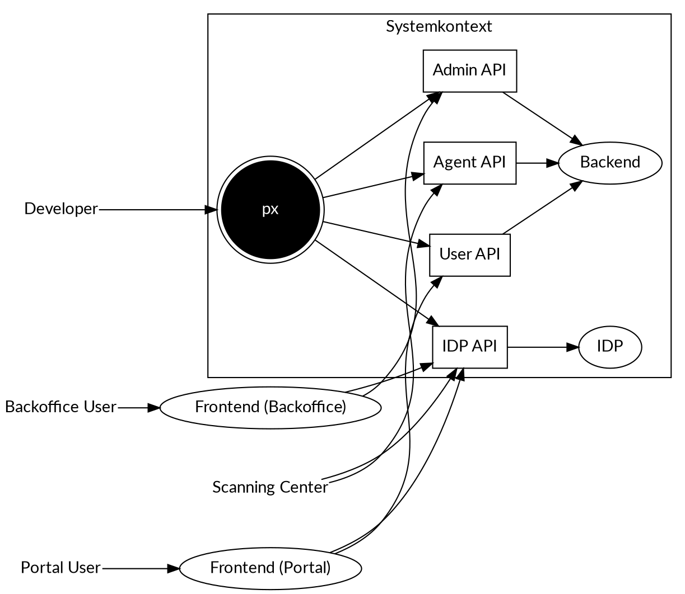
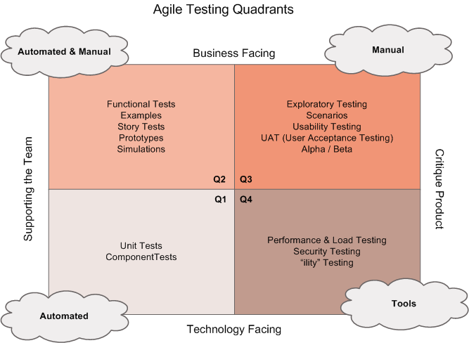
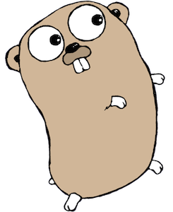
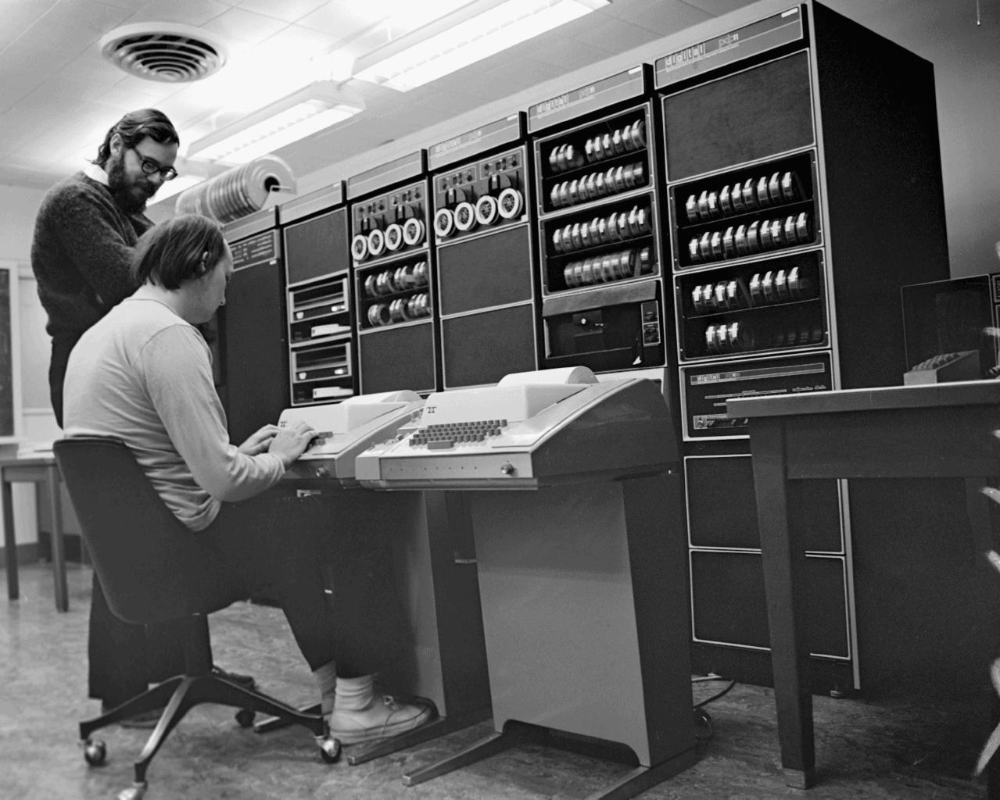

# Systemkontext

{height=240px}

# Problem

    curl -X POST -H "Cache-Control: no-cache" \
        -H "Content-Type: application/x-www-form-urlencoded" \
        --data "grant_type=password&client_id=peax.portal& ⏎
        username=683.4839.1914.79&password=Geheim" \
        https://sv-idp-keycloak-test.osapps.peax.ch/auth/ ⏎
        realms/peax-id-test/protocol/openid-connect/token \
        | jq -r .access_token > access_token
    curl -X POST -H "Authorization: Bearer $(cat access_token)" \
        -H "Content-Type: multipart/form-data; charset=UTF-8" \
        -F "document=@document.pdf;type=application/pdf" \
        -F "@meta.json;type=application/json" \
        https://sv-oauth-proxy-test.osapps.peax.ch/document/ ⏎
        api/v3/account/683.4839.1914.79/collection/upload

# Lösung

    px login -e test -u patrick.bucher@stud.hslu.ch
    px upload document.pdf -meta metadata.json

# Swiss Army Knive

Git:

    git status
    git add *.sh
    git commit -m 'added shell scripts'

px:

    px login -e test -u john.doe@foobar.com -p topsecret1337
    px upload document.pdf
    px logout -a

# Unix-Philosophie 

Verwendung als Befehl:

    px upload document.pdf

Verwendung im "Skript":

    px upload document.pdf | jq -r '.documentId' >> documentIds.txt

# Kompromiss

Hardcore:

    for doc in $(find /home/joe/docs -type f | grep '\.pdf$')
    do
        px upload "$doc"
    done

Benutzerfreundlich:

    px upload -r /home/joe/docs

# Teststrategie

{height=200px}

# Umsetzung

{height=240px}

# Programmiersprache Go

{height=100px}

# Live-Demo

{height=200px}
